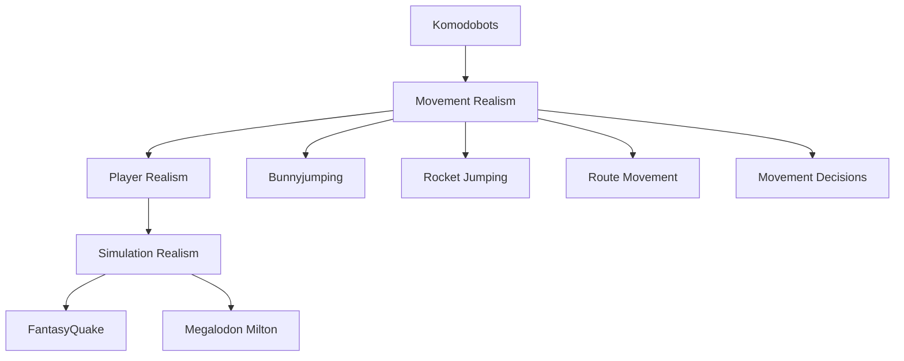
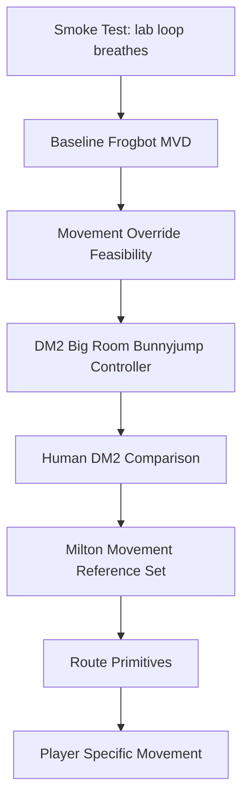

# Roadmap

Status: living document.

## North Star

## Experiment Ladder

## Current Stage

Current active stage:

`S3c - Cross-map/repeat validation for sidemove 200`

## Stage Status Table

| Stage | Status | Evidence Needed |
|---------|---------|---------|
| S0 Smoke Test | Complete | Bot moves, MVD recorded, MVD parsed |
| S1 Baseline | Complete | Measured current Frogbot movement with speed and airborne-proxy metrics |
| S2 Override | Provisionally satisfied pending review | Route-yaw mode `3` passed explicit v2c command/plausibility gates on `frobodm2` and `dm3` |
| S3 Bunnyjump Controller | Active; sidemove `200` is next candidate | Validate `sidemove=200` across maps/repeats before adding cadence or state |
| S4 Human Comparison | Pending | Metric comparison against human demos |
| S5 Milton Reference | Pending | Elite movement reference dataset |
| S6 Route Primitives | Pending | Route-level movement behaviours |
| S7 Player Specific | Pending | Player-style movement models |

## Roadmap Rule

Whenever a stage changes, update this file and record supporting evidence in:

- docs/07_FINDINGS_LOG.md
- docs/08_DECISION_LOG.md

## Route-Yaw Scaffold Stop Condition

Mode `3` and mode `4` deliberately commandeer view yaw to align movement with Frogbot route intent. That proves movement override mechanics, but it is not a believable player controller because a real player can aim at an enemy while moving route-relative.

S3c may validate `sidemove=200` because it is cheap and keeps the lab honest. If `sidemove=200` does not generalize beyond mode `3` across `frobodm2` and `dm3`, stop tuning sidemove/cadence cvars and pivot to aim-independent movement: compute `forwardmove` and `sidemove` from a desired route velocity relative to the bot's real combat view angle.
