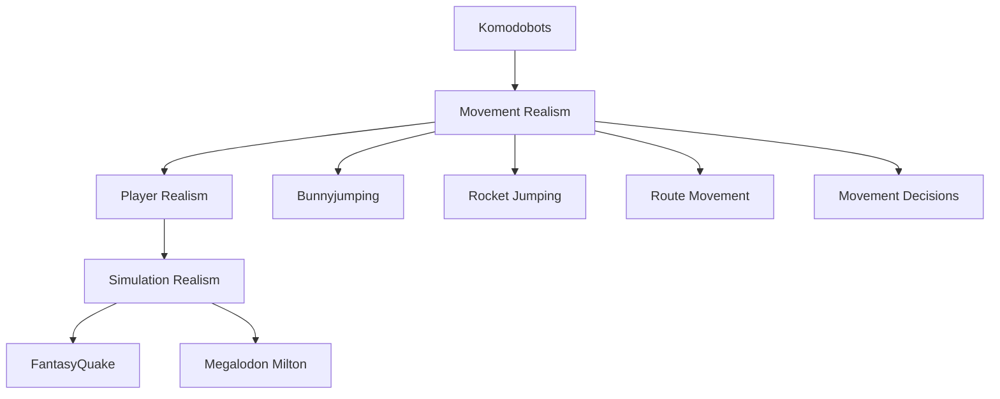
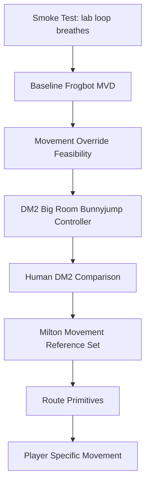

# Roadmap

Status: living document.

## North Star

## Experiment Ladder

## Current Stage

Current active stage:

`S6f - DM3 water-edge route geometry audit`

## Stage Status Table

| Stage | Status | Evidence Needed |
|---------|---------|---------|
| S0 Smoke Test | Complete | Bot moves, MVD recorded, MVD parsed |
| S1 Baseline | Complete | Measured current Frogbot movement with speed and airborne-proxy metrics |
| S2 Override | Provisionally satisfied pending review | Route-yaw mode `3` passed explicit v2c command/plausibility gates on `frobodm2` and `dm3` |
| S3 Bunnyjump Controller | Provisionally satisfied pending human anchor | S3g mode `7` passed `dm3` and `frobodm2` while preserving combat yaw, removing backward commands, and bounding sampled command magnitude near `824.6` |
| S4 Human Comparison | First same-map anchor complete | S4c parsed one human `dm3` 4on4 demo and compared it against S3g `dm3`; S3g is not yet human-like on the observed movement ranges |
| S5 Milton Reference | Tiny aggregate complete | S5b aggregates exact-player `dm3` references for Milton, carapace, and yeti; S3g remains below reference avg/p95 movement ranges |
| S6 Route Primitives | Active | S6e preserved native water-edge upmove but did not remove the repeated `water.LG` / `276->59` WATER_PATH low-speed pattern; S6f should inspect route-edge geometry before any more controller tuning |
| S7 Player Specific | Pending | Player-style movement models |

## Roadmap Rule

Whenever a stage changes, update this file and record supporting evidence in:

- docs/07_FINDINGS_LOG.md
- docs/08_DECISION_LOG.md

## Route-Yaw Scaffold Stop Condition

Mode `3` and mode `4` deliberately commandeer view yaw to align movement with Frogbot route intent. That proves movement override mechanics, but it is not a believable player controller because a real player can aim at an enemy while moving route-relative.

S3c validated `sidemove=200` as a repeatable route-yaw strafe candidate on `frobodm2` and `dm3`, but mode `3` and mode `4` still commandeer aim. S3d mode `5` then emitted aim-independent route/strafe commands, but behavior split. S3e diagnostics showed route-vs-view yaw deltas and backward local commands are plausible contributors, especially for `/ bro` on `dm3`, but not a complete explanation. S3f mode `6` removed backward commands and passed both routed maps, but did so with very large folded side commands. S3g mode `7` bounded those commands and passed both routed maps.

S4a built the human-demo parser scaffold and parsed one local `aerowalk` duel, but found no local true `dm2` candidate. S4b selected and parsed one true human `dm2` 4on4 demo from the existing `servexeri` corpus, but S3g bot evidence is on `dm3` and `frobodm2`. S4c selected a same-map human `dm3` 4on4 sample and compared it against S3g `dm3`; this solved the map mismatch, but showed S3g is still weak versus the human range on p95 speed and partly on average speed.

S5a proved exact-player reference selection is feasible from Turso metadata plus the existing corpus manifest, then parsed one exact `Milton` `dm3` sample. That sample shows a sharper S3g gap than the generic S4c human sample: S3g is below the sample's p95 range and `/ bro` is below average speed while above low-speed and airborne-proxy ranges.

S5b aggregates three exact-player `dm3` references from Milton, carapace, and yeti. The aggregate reference p95 range is `505.8` to `535.0`, while S3g `dm3` bots are `361.0` to `375.3`. The average-speed range is also lower for S3g: reference `282.8` to `314.2`, bots `190.1` to `248.2`.

S6a route-state diagnosis inspected S3g `dm3` run `20260606T003718Z` without changing movement commands. The current artifacts expose position traces, sampled final commands, route yaw, view yaw, yaw delta, backward-command diagnostics, and map-entity locations, but no Frogbot route node, next waypoint, target entity, obstruction, or route primitive state. Eight of nine analyzed top low-speed windows showed low speed despite average sampled horizontal command at or above `400`.

S6b route-state logging ran `dm3` mode `7` as `20260606T031102Z`. The new `route=` command suffix exposed marker/goal/path-state/blocked context. `/ bro` had `17` low-speed windows and all `5` analyzed top windows still had strong sampled command context; repeated `water.LG` windows shared linked/goal marker `59`, path state `32768`, and `blocked=0`. `/ goldenboy` had no S6-threshold low-speed windows in the same run.

S6c route-state attribution decoded `32768` as `WATER_PATH`, not `STUCK_PATH`, and grouped `3` `/ bro` `water.LG` low-speed windows around linked/goal marker `59`. The worst repeated windows use the `.bot` edge `276->59 idx=[0]`, have `blocked=0`, keep sampled command magnitude near `824`, and show low native `dir_speed` before the probe normalizes route direction.

S6d water-path diagnosis reran `dm3` mode `7` as `20260606T041805Z` with water/swim command logging. The repeated `/ bro` `water.LG` windows reproduced with `WATER_PATH`, `blocked=0`, and strong sampled commands. Window samples were waterlevel `[1]` or `[1, 2]`, never deep water, with `swim_arrow=0` and emitted `upmove=0`.

S6e preserved native water-edge vertical command intent only when stock KTX would allow it (`waterlevel > 1`) and reran one short `dm3` probe as `20260606T044000Z`. It did not help: repeated `water.LG` / `276->59` WATER_PATH windows persisted on `/ goldenboy`, and both bots had worse low-speed ratios. The next branch is S6f: inspect `.bot` edge geometry around `276->59` and marker `59` without another controller change. If that audit does not reveal a tiny route-data fix, pivot back toward the headline land-speed/bunnyhop gap or broader human reference evidence.
