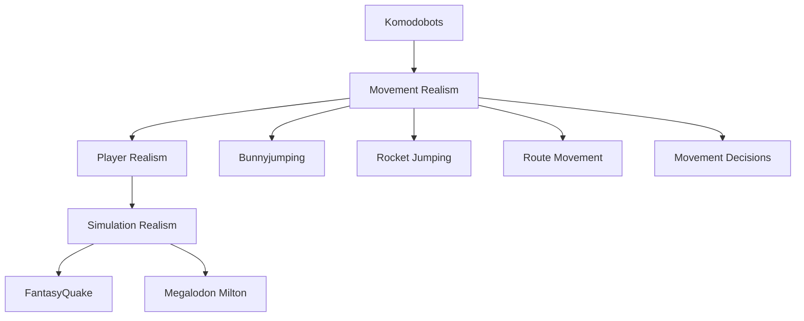
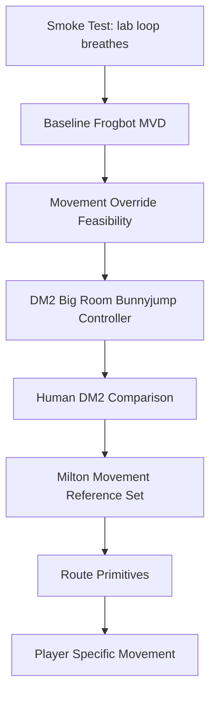

# Roadmap

Status: living document.

## North Star

## Experiment Ladder

## Current Stage

Current active stage:

`S3g - Bounded no-backpedal command probe`

## Stage Status Table

| Stage | Status | Evidence Needed |
|---------|---------|---------|
| S0 Smoke Test | Complete | Bot moves, MVD recorded, MVD parsed |
| S1 Baseline | Complete | Measured current Frogbot movement with speed and airborne-proxy metrics |
| S2 Override | Provisionally satisfied pending review | Route-yaw mode `3` passed explicit v2c command/plausibility gates on `frobodm2` and `dm3` |
| S3 Bunnyjump Controller | Active; no-backpedal aim-independent probe passes current gate, but command magnitudes are unrealistic | Bound or normalize mode `6` command magnitudes and rerun both routed maps |
| S4 Human Comparison | Pending | Metric comparison against human demos |
| S5 Milton Reference | Pending | Elite movement reference dataset |
| S6 Route Primitives | Pending | Route-level movement behaviours |
| S7 Player Specific | Pending | Player-style movement models |

## Roadmap Rule

Whenever a stage changes, update this file and record supporting evidence in:

- docs/07_FINDINGS_LOG.md
- docs/08_DECISION_LOG.md

## Route-Yaw Scaffold Stop Condition

Mode `3` and mode `4` deliberately commandeer view yaw to align movement with Frogbot route intent. That proves movement override mechanics, but it is not a believable player controller because a real player can aim at an enemy while moving route-relative.

S3c validated `sidemove=200` as a repeatable route-yaw strafe candidate on `frobodm2` and `dm3`, but mode `3` and mode `4` still commandeer aim. S3d mode `5` then emitted aim-independent route/strafe commands, but behavior split. S3e diagnostics showed route-vs-view yaw deltas and backward local commands are plausible contributors, especially for `/ bro` on `dm3`, but not a complete explanation. S3f mode `6` removed backward commands and passed both routed maps, but did so with very large folded side commands. The next branch is bounding command magnitudes before any larger controller work.
