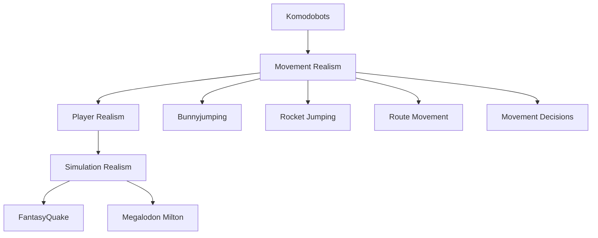
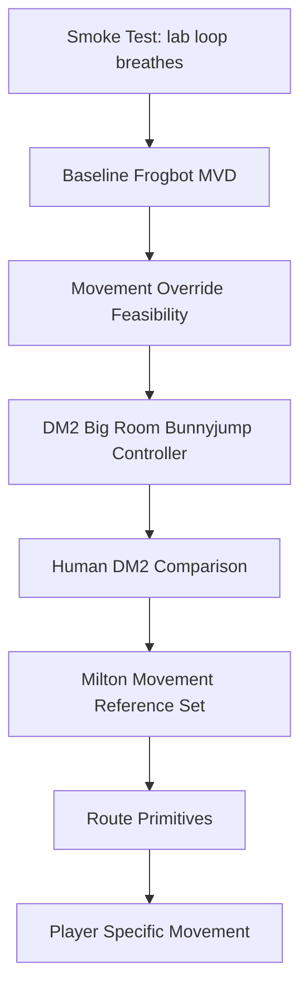

# Roadmap

Status: living document.

## North Star

## Experiment Ladder

## Current Stage

Current active stage:

`QWD-DM3-SNG - Tight-start rerun evidence; next diagnostic is dense/event-level start and advancement proof`

## Stage Status Table

| Stage | Status | Evidence Needed |
|---------|---------|---------|
| S0 Smoke Test | Complete | Bot moves, MVD recorded, MVD parsed |
| S1 Baseline | Complete | Measured current Frogbot movement with speed and airborne-proxy metrics |
| S2 Override | Provisionally satisfied pending review | Route-yaw mode `3` passed explicit v2c command/plausibility gates on `frobodm2` and `dm3` |
| S3 Bunnyjump Controller | Provisionally satisfied pending human anchor | S3g mode `7` passed `dm3` and `frobodm2` while preserving combat yaw, removing backward commands, and bounding sampled command magnitude near `824.6` |
| S4 Human Comparison | First same-map anchor complete | S4c parsed one human `dm3` 4on4 demo and compared it against S3g `dm3`; S3g is not yet human-like on the observed movement ranges |
| S5 Milton Reference | Tiny aggregate complete | S5b aggregates exact-player `dm3` references for Milton, carapace, and yeti; S3g remains below reference avg/p95 movement ranges |
| S6 Route Primitives | Closed for now | S6f found `276->59` is explicit and reciprocal, but marker `276` lacks static geometry, so no tiny route-data fix is justified from `dm3.bot` alone |
| S7 Player Specific | Paused behind QWD decision track | S7l found enough clean air-transition evidence for one narrower Frogbots probe, but the QWD action/trajectory bridge is now the faster Frogbots-vs-from-scratch decision path |
| QWD DM3 Route Transfer | Active but blocked from expansion | Tight-start run `20260607T003837Z` advances up to `12` SNG control points inside MVD, but still fails phase-target and slow-success guardrails; next evidence must prove exact advancement/start events and active-window movement quality before projection changes or other DM3 QWD moves |

## Roadmap Rule

Whenever a stage changes, update this file and record supporting evidence in:

- docs/07_FINDINGS_LOG.md
- docs/08_DECISION_LOG.md

## Route-Yaw Scaffold Stop Condition

Mode `3` and mode `4` deliberately commandeer view yaw to align movement with Frogbot route intent. That proves movement override mechanics, but it is not a believable player controller because a real player can aim at an enemy while moving route-relative.

S3c validated `sidemove=200` as a repeatable route-yaw strafe candidate on `frobodm2` and `dm3`, but mode `3` and mode `4` still commandeer aim. S3d mode `5` then emitted aim-independent route/strafe commands, but behavior split. S3e diagnostics showed route-vs-view yaw deltas and backward local commands are plausible contributors, especially for `/ bro` on `dm3`, but not a complete explanation. S3f mode `6` removed backward commands and passed both routed maps, but did so with very large folded side commands. S3g mode `7` bounded those commands and passed both routed maps.

S4a built the human-demo parser scaffold and parsed one local `aerowalk` duel, but found no local true `dm2` candidate. S4b selected and parsed one true human `dm2` 4on4 demo from the existing `servexeri` corpus, but S3g bot evidence is on `dm3` and `frobodm2`. S4c selected a same-map human `dm3` 4on4 sample and compared it against S3g `dm3`; this solved the map mismatch, but showed S3g is still weak versus the human range on p95 speed and partly on average speed.

S5a proved exact-player reference selection is feasible from Turso metadata plus the existing corpus manifest, then parsed one exact `Milton` `dm3` sample. That sample shows a sharper S3g gap than the generic S4c human sample: S3g is below the sample's p95 range and `/ bro` is below average speed while above low-speed and airborne-proxy ranges.

S5b aggregates three exact-player `dm3` references from Milton, carapace, and yeti. The aggregate reference p95 range is `505.8` to `535.0`, while S3g `dm3` bots are `361.0` to `375.3`. The average-speed range is also lower for S3g: reference `282.8` to `314.2`, bots `190.1` to `248.2`.

S6a route-state diagnosis inspected S3g `dm3` run `20260606T003718Z` without changing movement commands. The current artifacts expose position traces, sampled final commands, route yaw, view yaw, yaw delta, backward-command diagnostics, and map-entity locations, but no Frogbot route node, next waypoint, target entity, obstruction, or route primitive state. Eight of nine analyzed top low-speed windows showed low speed despite average sampled horizontal command at or above `400`.

S6b route-state logging ran `dm3` mode `7` as `20260606T031102Z`. The new `route=` command suffix exposed marker/goal/path-state/blocked context. `/ bro` had `17` low-speed windows and all `5` analyzed top windows still had strong sampled command context; repeated `water.LG` windows shared linked/goal marker `59`, path state `32768`, and `blocked=0`. `/ goldenboy` had no S6-threshold low-speed windows in the same run.

S6c route-state attribution decoded `32768` as `WATER_PATH`, not `STUCK_PATH`, and grouped `3` `/ bro` `water.LG` low-speed windows around linked/goal marker `59`. The worst repeated windows use the `.bot` edge `276->59 idx=[0]`, have `blocked=0`, keep sampled command magnitude near `824`, and show low native `dir_speed` before the probe normalizes route direction.

S6d water-path diagnosis reran `dm3` mode `7` as `20260606T041805Z` with water/swim command logging. The repeated `/ bro` `water.LG` windows reproduced with `WATER_PATH`, `blocked=0`, and strong sampled commands. Window samples were waterlevel `[1]` or `[1, 2]`, never deep water, with `swim_arrow=0` and emitted `upmove=0`.

S6e preserved native water-edge vertical command intent only when stock KTX would allow it (`waterlevel > 1`) and reran one short `dm3` probe as `20260606T044000Z`. It did not help: repeated `water.LG` / `276->59` WATER_PATH windows persisted on `/ goldenboy`, and both bots had worse low-speed ratios.

S6f inspected `.bot` edge geometry around `276->59` and marker `59` without another controller change. The edge and reciprocal are explicit, and S6d/S6e contain `30` unique focus-edge samples with `WATER_PATH`, `blocked=0`, and `86.7%` low native `dir_speed`; however, marker `276` has no static `CreateMarker` origin, so `dm3.bot` does not provide enough static geometry for a precise route-coordinate fix.

S7a seeded exact-player movement signatures from the existing `dm3` reference players. It keeps avg and p95 as generic S3g-vs-human land-speed gaps, marks low-speed and cadence as possible but thin style axes, and triggers the stop condition because the current set is one demo per player.

S7b broadened exact-player `dm3` references for the same targets where available. It selected and parsed one additional manifest-backed demo each for `Milton`, `carapace`, and `yeti`, making a six-row repeated aggregate. Avg and p95 remain stable but generic land-speed gaps. Low-speed and airborne proxy are mixed/overlapping under repeated samples. Jump cadence was the only repeated candidate axis, but it remained reference-only because the committed S3g summaries did not carry cadence.

S7c regenerated the committed S3g summary from existing artifacts so cadence is bot-comparable. The repeated exact-player cadence range is `40.4` to `51.0`/min; S3g `/ bro` is above that range at `91.7`/min, while `/ goldenboy` is within it at `43.3`/min. Cadence is now a bot-comparable repeated candidate axis with mixed bot relation, but avg/p95 remain generic land-speed gaps.

S7d normalized cadence by non-stationary time, non-low-speed time, and airborne-proxy time from the existing S7c aggregate. Movement-time normalization kept the mixed relation (`/ goldenboy` inside range, `/ bro` above), but airborne-proxy normalization put both S3g bots above the exact-player range (`174.4` to `207.6`/min vs reference `128.0` to `143.1`/min). Cadence stays diagnostic, not controller-authorizing.

S7e broadened bot cadence evidence from existing unchanged `dm3` mode-7 artifacts: S3g `20260606T003718Z`, S6b `20260606T031102Z`, and S6d `20260606T041805Z`. S6e `20260606T044000Z` is excluded because it changed water-edge vertical command behavior. Across six bot rows, active and movement-time cadence remain mixed, but every bot row stays above the exact-player airborne-proxy cadence range (`164.1` to `274.1`/min vs reference `128.0` to `143.1`/min). The next branch is S7f: inspect raw airborne-proxy segment distributions or pivot back to the larger land-speed gap before any cadence controller probe.

S7f inspected raw airborne-proxy segment distributions from the same six exact-player `dm3` references and six unchanged mode-7 bot rows. Bot player-median air duration is `217.2` ms vs reference `325.0` ms, Z range is `11.5` qu vs `43.8` qu, and air speed is `114.4` qu/s vs `431.8` qu/s. This explains the high airborne-proxy cadence as a symptom of broken air/land rhythm and horizontal-speed production, not a controller-ready cadence target. The next branch is S7g: characterize the land-speed gap around route and air segments before another controller probe.

S7g characterized accepted segment speed by context using the S7f row set. Bot all-segment p50 speed remains below reference (`222.0` vs `334.0` qu/s), but generic non-airborne p50 speed is close (`312.1` vs `320.0` qu/s). The gap concentrates around airborne-proxy segments (`122.6` vs `433.8`), pre-air windows (`207.1` vs `418.0`), post-air windows (`184.5` vs `365.7`), and sampled route `WATER_PATH` contexts (`95.3` qu/s). The next branch is S7h: choose whether the first controller probe targets air-transition horizontal speed production or a narrow route primitive such as `WATER_PATH` low-dir-speed recovery.

S7h selected air-transition horizontal speed production as the first controller-probe target from the committed S7g context. Air-transition evidence is human-comparable across six reference and six bot rows (`0.495` pre-air ratio, `0.283` airborne ratio, `0.505` post-air ratio) while generic non-airborne speed is near reference (`0.975`). `WATER_PATH` remains a guardrail and deferred narrow route target because it is very slow (`95.3` qu/s) but bot-only and route-diagnostic. The next branch is S7i: design a tiny air-transition horizontal-speed probe with unchanged cadence reporting, unchanged route diagnostics, and stop conditions that reject all-segment speed gains if air-transition buckets or `WATER_PATH` context get worse.

S7i designed the tiny air-transition horizontal-speed probe before changing controller behavior. The design consumes S7g/S7h/S7e evidence, preserves mode-7 behavior outside a future takeoff/air-transition command-budget probe, keeps cadence diagnostic, and requires pre-air/airborne/post-air/non-air/route/cadence reporting. Stop conditions reject all-segment speed gains if air-transition buckets do not improve, if non-airborne or `WATER_PATH` context regresses, or if cadence/route reporting disappears. The next branch is S7j: implement and run the tiny probe only if it preserves that contract.

S7j implemented mode `8` and reran the tiny air-transition horizontal-budget probe on `dm3` after fixing the transition gate to use the pre-probe jump intent instead of hardcoding active grounded frames. The combined fixed runs `20260606T163907Z` and `20260606T164610Z` reported transition activation in `546` command samples, active in `110` of them. The combined evidence rejects the probe under S7i stop conditions: all accepted segment p50 improved (`222.0 -> 230.0`), and `WATER_PATH` passed where present (`95.3 -> 96.2`), but pre-air p50 fell (`207.1 -> 149.7`), airborne-proxy p50 fell (`122.6 -> 100.4`), and non-airborne p50 fell below tolerance (`312.1 -> 286.3`). The next branch is S7k: inspect failed bucket and command/probe activation context before another controller probe.

S7k diagnosed the corrected S7j failed buckets without another lab rerun or movement-mode change. Pre-air and airborne-proxy failures are mixed controller/route-context failures: they have strong command coverage but substantial low-dir-speed/`WATER_PATH` context in the second S7j run. The non-airborne guardrail failure is route/map-context contaminated, driven by `/ goldenboy` in `20260606T164610Z` with non-airborne p50 `100.8` qu/s, low-dir ratio `0.626`, and `WATER_PATH` ratio `0.614`. Water is not the whole issue because first-run air-transition rows were still too slow with no `WATER_PATH` context. The next branch is S7l: design a smaller context-gated air-transition probe that either excludes low-dir-speed/`WATER_PATH` contexts or treats them as hard stop-condition slices before another lab rerun.

S7l designed the context-gated probe without another lab rerun or controller change. It splits S7k rows into clean air-transition candidates, route guardrail slices, and measurement-risk slices. Clean pre-air has `2` rows and `326` segments; clean airborne-proxy has `3` rows and `844` segments. Route-dirty slices remain large (`1,445` pre-air, `1,179` airborne, and `766` non-airborne segments), so the next branch is S7m: implement and run the context-gated air-transition probe with live route/water gating and separate clean-vs-route-dirty scoring.

The QWD trajectory route applicability probe is a parallel Frogbots-vs-from-scratch decision signal, not a replacement for S7l. It paired exact human commands with anchored self trajectory for all `29` local `dm3_*.qwd` trick demos (`22,749` paired frames, coverage min/p50 `1.000`, `29` route candidates at `64` qu spacing). This suggests a human-derived route/controller evidence path exists before abandoning KTX/Frogbots, but it still needs semantic mapping against `dm3.bot` and a controlled server-loop execution probe before claiming Frogbot applicability.

The first QWD-to-Frogbot mapping used `dm3_sng_shortcut.qwd`. The human trajectory is close to existing static Frogbot markers (nearest-marker p50/p95/max `70.112` / `120.324` / `142.597` qu; `0.939` within `128` qu), but collapsed human marker transitions have `0.0` direct `.bot` edge coverage and require multi-edge graph paths (p50/p95/max `5.0` / `15.8` / `17.0` edges). Because the QWD action labels are side-move dominant (`0.718` nonzero side vs `0.089` nonzero forward), the next QWD branch should be a hybrid waypoint/controller probe, not a pure `dm3.bot` route-following or route-editing probe.

The QWD SNG hybrid probe design turns that mapping into a bounded server-loop contract without changing KTX behavior yet. It preserves `14` QWD control points, proposes temporary mode `9`, recommends waypoint-attraction `forwardmove=320` plus QWD-style `sidemove=508`, forbids `dm3.bot` mutation, and requires route/water/command/probe/cadence/movement diagnostics. The next QWD branch should implement and run that mode, then decide whether positive SNG evidence justifies trying the remaining DM3 QWD moves.

The first QWD SNG hybrid server-loop probe implemented temporary mode `9`, runner QWD-cvar transport, QWD command-state parsing, and a scorer against the design guardrails. Run `20260606T221429Z` activated the QWD probe for `11` sampled rows and `1.12` seconds, preserved route/water/probe/cadence diagnostics, and passed slow/route-dirty success guardrails, but advanced only `2` control points against the required `4`. Follow-up diagnosis aligned command-log server time to MVD-relative event time and found the active `/ goldenboy` rows landed at `47044-48082` ms, outside the parsed `45816` ms MVD movement window; `/ bro` never reached the configured start radius. The result remains `qwd_sng_hybrid_probe_inconclusive`.

The QWD SNG setup repair reran the same mode `9`, QWD control points, `96` qu point radius, and `forwardmove=320` / `sidemove=508` profile with start radius widened to `320` qu. Run `20260606T231007Z` produced valid MVD evidence and repaired the timing/start-context blocker: `627` QWD active samples, `16.591` max active seconds, and `4` control points advanced inside the parsed MVD window. The scorer still rejects the run because `/ bro` advanced those points with low-speed ratio `0.429` and stationary ratio `0.253`, crossing the `0.40` / `0.25` slow-success guardrails.

The QWD SNG slow-success diagnosis split that accepted run by active control-point phase. `/ bro` was activated by the loose `320` qu start radius at `t=0` from `281.954` qu away, while the original `192` qu design radius would first have activated at `31652` ms when the bot was `83.332` qu from CP0. The CP0 phase had p50 speed `84.385` qu/s, low-speed ratio `0.526`, stationary ratio `0.383`, and blocked ratio `0.371`; after advancing through four points, the bot still remained `181.154` qu from CP4 against a `96` qu radius. Strong side/jump commands were present, and water/low-dir-speed were not primary. The next QWD branch should tighten activation and phase-level success gates before projection changes or trying other DM3 QWD moves.

The QWD SNG phase-gate tightening adds those gates to the scorer without changing movement behavior. Rescoring `20260606T231007Z` now rejects `tight_start_activation` because `/ bro` first activated inside the MVD at `281.954` qu from CP0 against the design `192` qu start radius, rejects `phase_target_progression` because `/ bro` spent `9.908` seconds on CP4 without getting closer than `183.876` qu against the `96` qu point radius, and keeps the existing `waypoint_only_slow_success` rejection. The next QWD branch should rerun mode `9` with the original `192` qu start radius and unchanged projection before any command-policy change or expansion to other DM3 QWD moves.

The QWD SNG tight-start rerun restored the original `192` qu activation radius and kept the same mode `9` projection. Run `20260607T003837Z` is the strongest QWD-to-Frogbot substrate signal so far: both bots activated inside the MVD window, `/ bro` advanced `11` control points, and `/ goldenboy` advanced `12`. It is still rejected as learned movement because `phase_target_progression` and `waypoint_only_slow_success` fail, while `tight_start_activation` is only inconclusive because the first active sampled rows were already at CP2. The diagnosis now preserves that as `qwd_sng_start_evidence_inconclusive`, so the next QWD branch should stay diagnostic: capture denser or event-level QWD start/advancement evidence and score active-window movement quality before changing projection policy or trying the rest of the DM3 QWD corpus.
